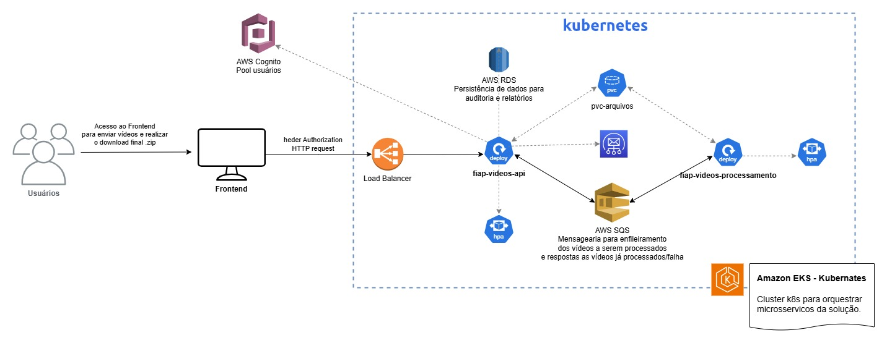

# Fiap Video Processamento


Projeto desenvolvido em Java Quarkus, para executar listener de mensagearia SQS e processamento de vídeos.
O objetivo é receber um vídeo, processar o mesmo e gerar um .zip com frames do vídeo processado.



> Diagrama de arquitetura elaborado.

## ⚙️ Tecnologias
O ambiente de desenvolvimento emprega múltiplas bibliotecas que visam otimizar a produtividade e garantir a qualidade do código. Entre elas, destacam-se:

- [Quarkus](https://quarkus.io/): Framework Java supersônico e subatômico, otimizado para Kubernetes e aplicações nativas em nuvem.  
- [Swagger](https://swagger.io/): Ferramenta para documentação e design de APIs RESTful.  
- [FFmpeg](https://ffmpeg.org/): Solução completa e multiplataforma para gravar, converter e transmitir áudio e vídeo.  
- [Zip](https://linux.die.net/man/1/zip): Utilitário para empacotar e compactar arquivos em um arquivo ZIP.  


## 💻 Pré-requisitos

Antes de começar, verifique se você atendeu aos seguintes requisitos:

### Startando SQS na maquina local para teste
Para executar o SQS local basta utilizar docker compose, para isso execute o comando:

```
docker compose up localstack
```

Após subir o container docker para SQS, basta configurar aws cli, conforme roteiro oficial citado logo abaixo, e depois executar os comandos para criar as filas:

```
aws sqs create-queue --queue-name=processar --profile localstack --endpoint-url=http://localhost:4566
aws sqs create-queue --queue-name=processados --profile localstack --endpoint-url=http://localhost:4566
```

Enviar mensagem de teste:
```
aws sqs send-message \
    --queue-url "http://sqs.us-east-1.localhost.localstack.cloud:4566/000000000000/processar" \
    --profile localstack --endpoint-url=http://localhost:4566 \
    --message-body '{
        "id": "12345",
        "idUsuario": "98765",
        "emailUsuario": "usuario@example.com",
        "status": "PROCESSADO",
        "pathVideo": "0b8c4280-30ab-4efa-92f3-7bb618847c46.mp4",
        "pathZip": "",
        "dowload": true
    }'

```


Roteiro oficial utilizado como guia:
https://docs.quarkiverse.io/quarkus-amazon-services/dev/amazon-sqs.html#_provision_sqs_locally_manually

## Pré-requisitos para o SO

É necessário instalar FFMPeg e ZIP no sistema operacional linux, para que os comandos executados pela aplicação funcionem corretamente.

```
sudo apt update
sudo apt install ffmpeg
sudo apt install zip
```
## PUT SQS para processamento de arquivos

Copie o arquivo **resources/arquivos/input.mp4** (vídeo de exemplo) para o diretório especificado em **path.processar** (definido em aplicattion.properties).
Após esse procedimento, você poderá executar o comando abaixo para simular a ação da API responsável por realizar upload do vídeo e publicação na fila de vídeos a serem processados.

```
aws sqs send-message --queue-url http://sqs.us-east-1.localhost.localstack.cloud:4566/000000000000/processar --message-body "{\"id\": \"12345\", \"status\": \"PROCESSANDO\", \"pathVideo\": \"input.mp4\", \"pathZip\": \"\"}" --region us-east-1 --profile localstack --endpoint-url=http://localhost:4566

```

## 🚀 Executando o projeto

O aplicativo pode ser empacotado usando:

```shell script
./mvnw package
```

Isso cria um arquivo `quarkus-run.jar` no diretório `target/quarkus-app/`.
Cuidado que não cria um arquivo _über-jar_ já que as dependências serão copiadas para o diretório `target/quarkus-app/lib/`.

A aplicação é executável usando o arquivo `java -jar target/quarkus-app/quarkus-run.jar`.

Se quiser buildar um _über-jar_, executar o comando:

```shell script
./mvnw package -Dquarkus.package.jar.type=uber-jar
```

A aplicação, empacotada como um _über-jar_, é executável utilizando `java -jar target/*-runner.jar`.

## Criando um executável nativo

É possivel criar um executável nativo com o comando:

```shell script
./mvnw package -Dnative
```

Caso não possua o GraalVM instalado, é possivel executar o nativo com um container utilizando:

```shell script
./mvnw package -Dnative -Dquarkus.native.container-build=true
```

Para executar os testes, utilize o seguinte comando:

```
./mvnw test
```
